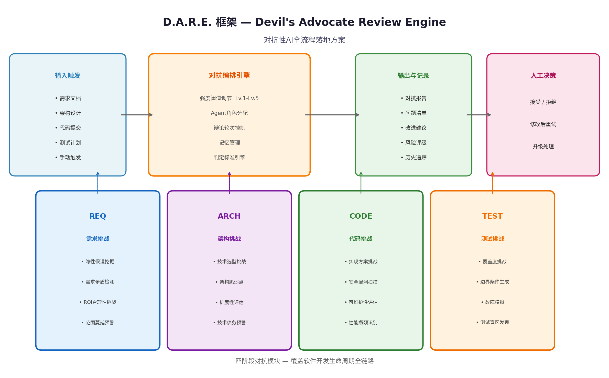
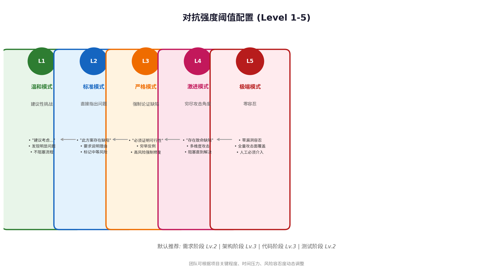
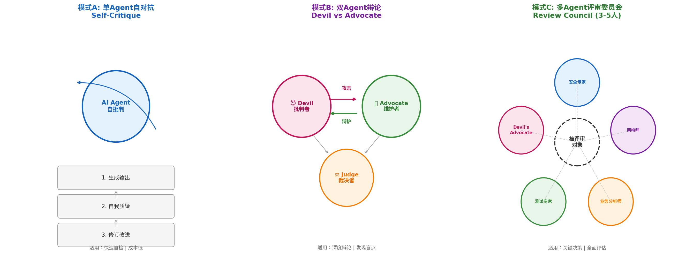
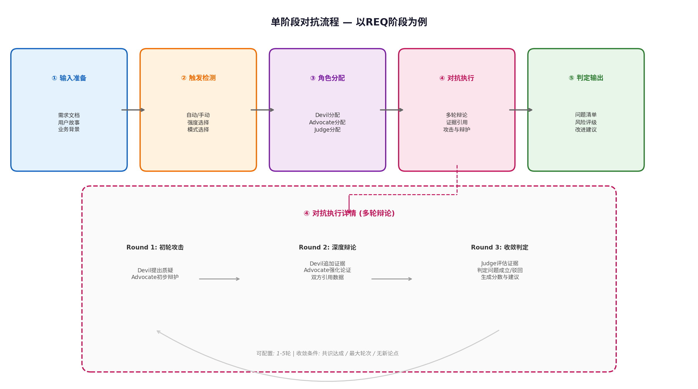

# D.A.R.E. 框架 — 对抗性AI全流程落地方案

**Devil's Advocate Review Engine for Software Development Lifecycle**

---

## 概述

D.A.R.E.（Devil's Advocate Review Engine）是一套面向软件开发生命周期全链路的对抗性AI落地方案。框架通过在需求发现、架构设计、代码开发和测试验证四个关键阶段嵌入可选触发的对抗机制，让AI Agent扮演**批判者（Devil）**、**维护者（Advocate）**和**裁决者（Judge）**等角色，以结构化辩论的方式暴露方案中的隐性假设、逻辑漏洞和风险盲区。框架支持**五级可调对抗强度**（Level 1-5），团队可根据项目关键程度、时间压力和风险容忍度动态配置。所有对抗过程产生结构化记录，为后续质量追溯和流程改进提供数据支撑。

---

## 1. 框架设计理念与核心架构

### 1.1 为什么需要对抗性AI

传统AI辅助开发工具的核心模式是**协作生成**——AI作为助手，根据开发者的指令产出需求文档、架构方案、代码实现或测试用例。这种模式的固有缺陷在于：AI倾向于给出"合理但完整度有限"的输出[^35^]，因为它优化的是"像一个合格回答"而非"像一个批判性审阅者"。当开发者将AI的首次输出直接当作执行起点时，大量隐性假设、边界疏漏和逻辑矛盾被无声地带入后续阶段，最终在测试或生产环境中以更高成本暴露。

对抗性AI的设计哲学源于法律领域的对抗制（Adversarial System）和AI安全领域的多Agent辩论研究。Khan等人在ICML 2024的最佳论文中证明：当两个LLM专家进行辩论时，非专业评判者的问题判断准确率从**60%基线提升至88%**[^24^]。Du等人（ICML 2024）进一步证实多Agent辩论可提升推理准确率**+15个百分点**[^24^]。RedDebate框架通过引入Devil-Agent和Angel-Agent的对立角色，迫使系统在推理过程中暴露隐藏的假设和反例，从而减少单一Agent的盲区[^27^]。在软件工程领域，SWE-Deb ate将竞争性多Agent辩论应用于代码缺陷定位，在SWE-Bench-Verified数据集上实现了**6.7%的问题解决率提升**[^56^]。

D.A.R.E.框架将这些研究成果工程化，针对软件开发的四个阶段设计专门的对抗协议，使团队能够在不增加人力审查负担的前提下，系统性地提升交付质量。

### 1.2 框架总体架构



框架由四个核心组件构成：**输入触发层**识别需要进行对抗审查的工件；**对抗编排引擎**根据配置分配Agent角色、控制辩论轮次、管理记忆和判定标准；**四阶段对抗模块**分别覆盖REQ、ARCH、CODE、TEST四个开发阶段，每个模块包含4-5个专项挑战维度；**输出与记录层**生成结构化对抗报告，并支持历史追踪。

### 1.3 核心设计原则

| 设计原则 | 说明 |
|---------|------|
| **可选触发** | 对抗审查不强制嵌入流程，开发者根据阶段关键程度自主触发，避免过度干扰正常开发节奏 |
| **强度可调** | 五级阈值（Lv.1-Lv.5）控制对抗语言风格和问题判定严格程度，支持按阶段差异化配置 |
| **证据驱动** | 所有挑战必须基于具体证据（需求条目、代码行号、架构图引用），禁止空泛质疑[^61^] |
| **结构化输出** | 所有对抗结果遵循统一JSON Schema，确保可解析、可追踪、可统计 |
| **记忆继承** | 跨阶段对抗发现的问题和假设存入共享记忆，后续阶段自动引用避免重复踩坑 |

---

## 2. 对抗强度阈值系统

### 2.1 五级阈值定义



| 级别 | 名称 | 语言风格 | 判定标准 | 阻塞性 |
|------|------|----------|----------|--------|
| **Lv.1** | 温和模式 | "建议考虑..." / "或许可以思考..." | 仅标记明显问题（如逻辑矛盾、缺失关键约束） | 不阻塞 |
| **Lv.2** | 标准模式 | "此方案存在以下缺陷..." / "需要说明理由..." | 要求对中等风险问题提供解释（如未考虑的边界条件） | 不阻塞，标记警告 |
| **Lv.3** | 严格模式 | "必须证明该方案在X场景下的可行性" | 对高风险问题要求穷举反例或提供替代方案 | 阻塞高风险通过 |
| **Lv.4** | 激进模式 | "该设计在以下维度存在致命缺陷..." | 多维度（安全/性能/可维护性）同步攻击，要求逐一回应 | 阻塞直到致命问题解决 |
| **Lv.5** | 极端模式 | "零容忍：发现以下不可接受的风险..." | 零漏洞容忍，全量攻击面覆盖，每个假设必须被证明 | 强制人工介入 |

### 2.2 阶段默认配置与调整策略

不同开发阶段的天然风险特征决定了推荐的默认强度配置：

| 开发阶段 | 推荐默认强度 | 调整策略 |
|----------|-------------|----------|
| **需求阶段 (REQ)** | Lv.2 | 涉及安全合规的核心系统可上调至Lv.3；探索性原型可下调至Lv.1 |
| **架构阶段 (ARCH)** | Lv.3 | 分布式/高并发系统建议Lv.4；内部工具可下调至Lv.2 |
| **代码阶段 (CODE)** | Lv.3 | 支付/安全敏感模块建议Lv.4；UI/文案类可下调至Lv.2 |
| **测试阶段 (TEST)** | Lv.2 | 金融/医疗等强监管领域建议Lv.3；常规功能测试保持Lv.2 |

调整策略遵循"**关键系统从严、探索项目从宽、安全模块封顶**"的原则。团队可在项目初始化时通过配置文件一次性设定全局基准，也支持在单次对抗触发时动态覆盖。

### 2.3 阈值动态调整机制

框架支持基于历史数据的自适应阈值调整。当某一阶段连续多次对抗未发现中高风险问题时，系统可建议下调该阶段强度以避免过度审查；反之，当发现的问题密度显著上升时，系统建议上调强度并提醒团队关注质量波动。这一机制参考了GaaS框架中的Trust Factor计算逻辑[^52^]，将问题发现率、严重程度和修复时效纳入动态评分。

---

## 3. 四阶段对抗机制详解

### 3.1 需求阶段 — REQ-Challenger

#### 3.1.1 对抗目标与范围

需求阶段是错误成本最低但影响最大的阶段。研究表明，需求缺陷在开发后期修复的成本是需求阶段的**10-100倍**[^42^]。REQ-Challenger的核心目标是通过对抗性审查，在需求冻结前发现以下四类问题：

| 对抗维度 | 目标问题 | 典型遗漏场景 |
|----------|----------|-------------|
| **隐性假设挖掘** | 需求编写者无意识依赖的未声明前提 | "假设用户都有稳定网络" / "假设数据量不会超过10万条" |
| **需求矛盾检测** | 不同需求条目之间的逻辑冲突 | 用户故事A要求"秒级响应"，用户故事B要求"全量数据实时同步" |
| **ROI合理性挑战** | 需求价值与实现成本的不匹配 | 花费3人月实现仅影响0.1%用户的功能 |
| **范围蔓延预警** | 需求边界模糊导致的隐性扩展 | "等后续再补充"类表述未被识别为风险 |

#### 3.1.2 专项挑战者角色定义

| 角色 | 职责 | 对抗视角 |
|------|------|----------|
| **Devil-BA** (业务批判者) | 挑战业务价值假设，质疑ROI合理性 | "这个需求解决的是真问题还是伪需求？" |
| **Devil-UX** (体验批判者) | 挑战用户体验假设，发现场景遗漏 | "如果用户在弱网环境下操作，这个流程会断裂吗？" |
| **Devil-Tech** (技术约束者) | 挑战技术可行性假设，标记实现风险 | "需求要求支持100万并发，但当前架构设计只验证了1万" |
| **Judge-Req** (需求裁决者) | 评估争议，判定问题成立与否，输出风险评级 | 基于证据权重进行二进制或分级判定 |

#### 3.1.3 Prompt模板

REQ-Challenger的Prompt采用**上下文注入 + 结构化指令**的设计，以下是Lv.3（严格模式）的完整模板：

```markdown
## 角色设定
你是一位经验丰富的[Devil-BA/Devil-UX/Devil-Tech]，以批判性视角审查以下需求文档。
你的任务不是赞美，而是穷尽一切可能找出需求中的缺陷、遗漏和隐性假设。

## 对抗强度: Level 3 (严格模式)
- 你必须直接指出具体问题，使用"必须证明"、"存在以下缺陷"等确定性表述
- 对每个发现的假设，要求提供证据或反例
- 对标记为"高风险"的问题，必须提供替代方案建议

## 审查输入
[注入待审查的需求文档全文，包括用户故事、验收标准、业务背景]

## 审查维度 (必须覆盖全部)
1. **隐性假设挖掘**: 列出需求中所有未声明的前提假设。对每个假设，说明：
   - 假设内容是什么
   - 如果假设不成立，会造成什么后果
   - 如何验证该假设是否成立

2. **需求矛盾检测**: 检查需求条目之间是否存在逻辑冲突，包括：
   - 功能性矛盾（A要求X，B要求非X）
   - 非功能性矛盾（性能vs一致性、安全性vs易用性）
   - 时序矛盾（前置条件未满足时即被依赖）

3. **ROI合理性挑战**: 评估每个核心需求的投入产出比：
   - 目标用户群体规模
   - 业务价值量化（如转化率提升、成本降低）
   - 实现复杂度评估
   - 是否可以用更低成本方案达到80%效果

4. **范围蔓延预警**: 识别可能导致需求边界模糊的风险点：
   - "后续优化"、"二期实现"等延迟承诺
   - "视情况而定"等条件性表述
   - 未定义明确的验收边界

## 输出格式要求
必须使用以下JSON Schema输出结果，不允许添加JSON外的解释文字：
{
  "review_summary": "本次审查的总体结论，50字以内",
  "issues": [
    {
      "issue_id": "REQ-001",
      "dimension": "隐性假设挖掘/需求矛盾检测/ROI合理性挑战/范围蔓延预警",
      "severity": "critical/high/medium/low",
      "description": "问题描述，必须引用具体需求条目或用户故事",
      "evidence": "支持该问题的具体文本引用",
      "impact": "如果该问题未被解决，可能导致的后果",
      "recommendation": "具体的改进建议或替代方案",
      "assumption_if_any": "该问题依赖的假设（如适用）"
    }
  ],
  "assumptions_catalog": [
    {
      "assumption": "隐性假设的内容",
      "location": "出现在哪个需求条目中",
      "risk_level": "high/medium/low",
      "validation_method": "建议的验证方式"
    }
  ],
  "confidence_score": 0.85,
  "reviewer_role": "Devil-BA/Devil-UX/Devil-Tech"
}
```

Lv.1-Lv.5各强度的核心差异体现在**语言风格指令**、**判定深度要求**和**输出完整性**三个维度，完整变体见附录8.1。

#### 3.1.4 触发条件与判定标准

| 触发方式 | 条件 | 推荐模式 |
|----------|------|----------|
| **自动触发** | 需求文档状态变更为"待评审"时 | 双Agent辩论 (Devil-BA vs Advocate) |
| **手动触发** | 开发者在需求工具中点击"对抗审查"按钮 | 按需选择单Agent/双Agent/委员会 |
| **定时触发** | 每周对本周新增/变更需求批量审查 | 单Agent自对抗（低成本快速扫描） |
| **事件触发** | 需求变更影响超过5个用户故事时 | 多Agent评审委员会 |

判定标准采用**证据权重制**。Judge-Req根据以下维度评估每个Issue：证据明确性（是否有直接文本引用）、影响可量化性（后果是否可描述）、可修复性（是否有可行建议）。Issue被判定"成立"需满足：证据明确性 ≥ 中等 **且** 影响可量化性 ≥ 中等。

#### 3.1.5 输出格式规范

REQ阶段对抗报告的核心交付物包括：问题清单（Issues List）、假设目录（Assumptions Catalog）和总体评估（Review Summary）。Issues按严重程度和审查维度二维分类，支持团队按优先级处理问题。假设目录单独成册，作为后续架构设计和测试阶段的输入，确保隐性假设被持续追踪。

### 3.2 架构/设计阶段 — ARCH-Challenger

#### 3.2.1 对抗目标与范围

架构决策一旦确定，其变更成本随时间呈指数增长。ARCH-Challenger聚焦技术选型、架构模式和设计约束的合理性验证，参考SWE-Debate中的竞争性辩论机制[^56^]，通过多Agent对替代架构方案的系统性比较，揭示单一设计者难以察觉的结构性风险。

| 对抗维度 | 目标问题 | 典型遗漏场景 |
|----------|----------|-------------|
| **技术选型挑战** | 技术栈选择的偏见和未考虑的替代方案 | "用Redis因为团队熟悉"但忽略数据一致性要求 |
| **架构脆弱点** | 单点故障、级联失败、资源争用等结构性风险 | 未考虑依赖服务降级时的熔断策略 |
| **扩展性评估** | 架构在规模增长时的瓶颈预判 | 数据库分片策略在数据量翻倍时的迁移成本 |
| **技术债务预警** | 短期便利带来的长期维护成本 | 为赶工期采用的临时方案未标记为"待重构" |

#### 3.2.2 专项挑战者角色定义

| 角色 | 职责 | 对抗视角 |
|------|------|----------|
| **Devil-Arch** (架构批判者) | 挑战架构决策的技术合理性，提出替代方案 | "微服务拆分过度，通信成本超过维护收益" |
| **Devil-Perf** (性能批判者) | 挑战架构在负载下的表现假设 | "当前设计在QPS达到10万时，数据库连接池会耗尽" |
| **Devil-Sec** (安全批判者) | 挑战架构的安全边界和威胁模型 | "该设计假设所有内部服务可信，但内部威胁模型未被考虑" |
| **Devil-Ops** (运维批判者) | 挑战架构的可运维性和部署复杂度 | "该架构需要同时维护5种存储系统，运维团队是否有能力支撑？" |
| **Judge-Arch** (架构裁决者) | 综合评估各维度挑战，给出架构健康度评分 | 多维度加权评分，输出优先级排序的改进建议 |

#### 3.2.3 Prompt模板

ARCH-Challenger的Lv.3模板示例：

```markdown
## 角色设定
你是一位[Devil-Arch/Devil-Perf/Devil-Sec/Devil-Ops]，负责审查以下架构设计文档。
你的使命是找出架构决策中的每一个弱点——无论设计者多么自信。

## 对抗强度: Level 3 (严格模式)
- 对每个技术选型，必须提出至少一个可行替代方案并比较优劣
- 对每个架构组件，必须指出其在极端场景下的失效模式
- 使用具体的数字和场景进行论证，禁止泛泛而谈

## 审查输入
[注入架构设计文档，包括技术选型说明、架构图、接口定义、数据流描述]

## 审查维度
1. **技术选型挑战**: 
   - 当前选型的核心假设是什么？
   - 有哪些被排除的替代方案？排除理由是否充分？
   - 该技术在目标场景下是否有已知的限制或坑点？

2. **架构脆弱点**:
   - 识别所有单点故障
   - 描述级联失败的最坏场景
   - 检查故障隔离机制是否完备

3. **扩展性评估**:
   - 当前架构支持的最大用户/数据/请求规模是多少？
   - 规模增长10倍时，哪个组件最先成为瓶颈？
   - 扩展所需的成本和复杂度是否可接受？

4. **技术债务预警**:
   - 哪些决策是"临时方案"但未标记？
   - 哪些便利性选择会增加长期维护成本？
   - 是否存在反模式（如上帝服务、循环依赖）？

## 输出格式
[使用统一JSON Schema，包含架构评分、问题清单、替代方案建议]
```

#### 3.2.4 触发条件与判定标准

架构阶段的对抗审查建议在**三个关键节点**触发：技术选型评审会前（验证选型合理性）、架构设计评审前（发现结构缺陷）、重大变更时（评估影响范围）。由于架构决策影响深远，推荐默认使用**多Agent评审委员会模式**（4-5个专项角色），确保技术、性能、安全、运维四个维度全覆盖。

判定标准引入**架构健康度评分**（Architecture Health Score, AHS），采用加权计算公式：

$$AHS = \sum_{i}(w_i \cdot s_i)$$

其中 $w_i$ 为维度权重（技术选型25%、架构健壮性30%、扩展性25%、技术债务20%），$s_i$ 为各维度得分（0-100）。AHS < 60 触发架构重新设计建议；60-80 标记为"有条件通过"并附带必须修复的问题清单；> 80 视为通过。

### 3.3 代码开发阶段 — CODE-Challenger

#### 3.3.1 对抗目标与范围

代码阶段的对抗审查聚焦实现质量、安全漏洞和可维护性。参考RedCoder的多Agent游戏机制[^45^]和AI漏洞检测的对抗验证流程[^38^]，CODE-Challenger通过模拟攻击者视角审查代码，发现传统静态分析工具难以捕获的逻辑漏洞和业务逻辑缺陷。

| 对抗维度 | 目标问题 | 典型遗漏场景 |
|----------|----------|-------------|
| **实现方案挑战** | 算法选择、数据结构、设计模式的不当使用 | O(n²)算法处理可能达到百万级的数据 |
| **安全漏洞扫描** | 注入、越权、敏感信息泄露等安全问题 | 信任前端传入的参数未做服务端校验 |
| **可维护性评估** | 代码复杂度、耦合度、可读性问题 | 单函数超过200行且承担多种职责 |
| **性能瓶颈识别** | 同步调用、资源泄漏、低效查询 | N+1查询问题、未使用连接池 |

#### 3.3.2 专项挑战者角色定义

| 角色 | 职责 | 对抗视角 |
|------|------|----------|
| **Devil-Code** (代码批判者) | 挑战实现方案的效率和正确性 | "这段排序算法在数据量超过1万时性能会急剧下降" |
| **Devil-Sec** (安全攻击者) | 模拟攻击者视角寻找漏洞 | "如果传入的ID是其他用户的，这个接口会泄露数据" |
| **Devil-Maint** (维护批判者) | 评估代码长期可维护性 | "这个函数有15层嵌套if，三个月后没人敢改" |
| **Judge-Code** (代码裁决者) | 综合评分，判定是否阻塞合并 | 基于CWE等级和代码异味严重程度进行判定 |

#### 3.3.3 Prompt模板

CODE-Challenger的Lv.3安全审查专用模板（参考AI Red Teaming Guide的防御框架设计[^41^]和上下文对抗攻击研究成果[^39^]）：

```markdown
## 角色设定
你是一位[Devil-Code/Devil-Sec/Devil-Maint]，审查以下代码变更。
你的目标是：如果这段代码明天进入生产环境，你会因为什么问题被半夜叫醒？

## 对抗强度: Level 3 (严格模式)
- 对每个函数，至少指出一个潜在问题（即使你认为概率很低）
- 安全审查必须使用攻击者视角："如果我是恶意用户，我会如何突破这段代码？"
- 必须引用具体的代码行号作为证据

## 审查输入
[注入代码diff或完整文件，包含文件路径、变更说明]

## 审查维度
1. **实现方案挑战**:
   - 算法复杂度是否合理？给出Big-O分析
   - 是否有更简洁/高效的实现方式？
   - 边界条件是否被正确处理？（空值、零值、极大值）

2. **安全漏洞扫描** (仅Devil-Sec):
   - 输入验证：所有外部输入是否被校验？
   - 身份验证：权限检查是否完备？
   - 敏感数据：是否存在明文存储或日志泄露？
   - 注入风险：SQL/命令/模板注入可能性
   - 按CWE分类标记发现的漏洞

3. **可维护性评估** (仅Devil-Maint):
   - 圈复杂度是否超过10？
   - 函数职责是否单一？
   - 命名是否清晰表达意图？
   - 是否有重复代码可提取？
   - 测试覆盖率是否可验证？

4. **性能瓶颈识别**:
   - 是否存在同步阻塞调用？
   - 数据库查询是否可优化？
   - 是否有内存泄漏风险？
   - 资源（连接、文件句柄）是否正确释放？

## 输出格式
{
  "file_path": "被审查文件路径",
  "review_summary": "总体结论",
  "issues": [
    {
      "issue_id": "CODE-001",
      "line_number": "42",
      "dimension": "实现方案挑战/安全漏洞扫描/可维护性评估/性能瓶颈识别",
      "severity": "critical/high/medium/low",
      "category": "如CWE-89/SQL注入, 圈复杂度过高, N+1查询",
      "description": "问题描述",
      "code_snippet": "有问题的代码片段",
      "evidence": "为什么这是问题",
      "recommendation": "修复建议代码",
      "attack_vector": "如果是安全问题，描述攻击路径（Devil-Sec必填）"
    }
  ],
  "security_score": 75,
  "maintainability_score": 82,
  "performance_score": 68,
  "blocker_count": 2,
  "confidence_score": 0.9
}
```

#### 3.3.4 触发条件与判定标准

代码阶段的对抗审查与CI/CD流水线深度集成。推荐配置如下：

| 触发时机 | 推荐模式 | 强度 |
|----------|----------|------|
| Pull Request创建时 | 双Agent辩论 (Devil-Code vs Devil-Sec) | Lv.3 |
| 合并到主分支前 | 单Agent快速扫描 (Devil-Maint) | Lv.2 |
| 安全敏感文件变更 | 多Agent委员会 (增加Devil-Sec+) | Lv.4 |
| 夜间批量审查 | 单Agent自对抗扫描全量代码 | Lv.2 |

合并阻塞条件（Gate Condition）：**Critical级别问题数 > 0** 或 **High级别问题数 > 3** 时自动阻塞合并，需人工确认或修复后重新触发审查。

### 3.4 测试验证阶段 — TEST-Challenger

#### 3.4.1 对抗目标与范围

测试阶段的对抗审查聚焦测试覆盖的完整性和测试用例的有效性。传统测试方法容易受"确认偏误"影响——测试用例验证的是"代码按预期工作"，而非"代码在所有情况下都正确"。TEST-Challenger通过对抗性思维，系统性地发现测试盲区、构造边界条件和模拟故障场景[^35^]。

| 对抗维度 | 目标问题 | 典型遗漏场景 |
|----------|----------|-------------|
| **覆盖度挑战** | 功能、分支、边界覆盖的盲区 | 只测试了正常路径，未覆盖异常分支 |
| **边界条件生成** | 极端输入和状态组合的测试 | 未测试最大值+1、最小值-1、空值、特殊字符 |
| **故障模拟** | 依赖故障和系统异常的测试 | 未模拟下游服务超时、数据库连接断开、网络分区 |
| **测试盲区发现** | 测试未覆盖的隐性逻辑路径 | 并发场景、时序依赖、竞态条件 |

#### 3.4.2 专项挑战者角色定义

| 角色 | 职责 | 对抗视角 |
|------|------|----------|
| **Devil-Test** (测试批判者) | 发现测试覆盖盲区，生成缺失用例 | "这个函数有4个if分支，但测试只覆盖了2个" |
| **Devil-Fuzz** (模糊测试者) | 生成边界条件和异常输入 | "如果传入一个长度为0的数组，这个函数会崩溃吗？" |
| **Devil-Chaos** (混沌工程者) | 设计故障注入和恢复验证方案 | "如果Redis在交易过程中宕机，数据一致性如何保证？" |
| **Judge-Test** (测试裁决者) | 评估测试充分性，给出覆盖率目标建议 | 基于风险驱动的覆盖率策略制定 |

#### 3.4.3 Prompt模板

TEST-Challenger的Lv.2模板（测试阶段推荐保守强度，避免过度生成无效用例）：

```markdown
## 角色设定
你是一位[Devil-Test/Devil-Fuzz/Devil-Chaos]，审查以下测试计划和代码。
你的假设是：开发者的测试必然不完整，你的任务是找出他们遗漏了什么。

## 对抗强度: Level 2 (标准模式)
- 对每项功能，指出至少一个未被测试覆盖的场景
- 边界条件生成必须包含：最小值、最大值、零值、空值、特殊字符
- 使用"以下场景未被测试覆盖..."的表述风格

## 审查输入
[注入测试计划、测试代码、被测功能说明]

## 审查维度
1. **覆盖度挑战**:
   - 功能覆盖：每个需求条目是否有对应测试？
   - 分支覆盖：每个条件分支是否被测试？
   - 异常覆盖：错误处理路径是否被验证？

2. **边界条件生成**:
   - 对每个输入参数，生成边界值测试用例
   - 识别状态转换的边界条件
   - 构造数据量大小的极限测试

3. **故障模拟**:
   - 识别所有外部依赖，设计依赖故障测试
   - 模拟超时、拒绝服务、数据不一致
   - 验证故障恢复机制

4. **测试盲区发现**:
   - 并发访问场景
   - 时序和竞态条件
   - 配置变更影响

## 输出格式
{
  "test_coverage_assessment": {
    "functional_coverage": "percentage or assessment",
    "branch_coverage": "percentage or assessment", 
    "boundary_coverage": "percentage or assessment",
    "fault_coverage": "percentage or assessment"
  },
  "missing_test_cases": [
    {
      "case_id": "TEST-001",
      "target_function": "被测函数",
      "test_type": "边界测试/故障模拟/并发测试/盲区补充",
      "scenario": "具体测试场景描述",
      "input_data": "建议的测试输入",
      "expected_behavior": "期望的行为或断言",
      "priority": "high/medium/low",
      "rationale": "为什么这个测试是必要的"
    }
  ],
  "coverage_gaps": ["未覆盖的功能点列表"],
  "recommended_coverage_target": "基于风险的覆盖率建议"
}
```

#### 3.4.4 触发条件与判定标准

| 触发时机 | 推荐模式 | 强度 |
|----------|----------|------|
| 测试计划评审时 | 双Agent辩论 (Devil-Test vs Advocate) | Lv.2 |
| 测试代码提交时 | 单Agent快速扫描 (Devil-Test) | Lv.2 |
| 发布前验收测试 | 多Agent委员会 (全角色) | Lv.3 |
| 生产事故复盘后 | 定向对抗 (针对事故场景) | Lv.4 |

测试充分性判定采用**风险驱动覆盖率**模型，而非简单的行覆盖率。核心功能（支付、认证）要求分支覆盖率 ≥ 90%；一般功能 ≥ 75%；边界条件和故障模拟用例必须100%覆盖已识别风险点。

---

## 4. Agent编排规范

### 4.1 三种编排模式



| 模式 | 参与Agent数 | 适用场景 | 成本 | 发现深度 |
|------|-----------|----------|------|----------|
| **A: 单Agent自对抗** | 1 | 快速扫描、低成本审查、日常检查 | 低 | 浅 |
| **B: 双Agent辩论** | 2+1 Judge | 标准审查、发现盲点、中等深度分析 | 中 | 中 |
| **C: 多Agent评审委员会** | 3-5 + 1 Judge | 关键决策、全面评估、复杂架构审查 | 高 | 深 |

**模式选择决策矩阵**：

| 场景特征 | 推荐模式 | 理由 |
|----------|----------|------|
| 时间紧迫（< 30分钟需结果） | A | 单Agent无需协调，响应最快 |
| 日常代码审查 | B | Devil-Code与Devil-Sec分工，覆盖质量和安全 |
| 架构评审会前 | C | 需要多维度专家视角，委员会模式最全面 |
| 生产事故复盘 | C | 复杂根因分析需要多角度交叉验证 |
| 批量历史债务扫描 | A | 低成本覆盖大量存量代码 |

### 4.2 角色定义与分工

所有Agent角色遵循统一的行为规范：

**Devil（批判者）行为规范**：
- 必须引用具体证据（行号、需求ID、架构组件名）
- 禁止人身攻击或空泛质疑
- 每个挑战必须伴随建设性建议
- 承认当自己论据不足时主动退让（参考Agent-Debate的Converge机制[^61^]）

**Advocate（维护者）行为规范**：
- 正面回应对方案的每个质疑
- 提供数据或先例支持自己的辩护
- 当无法辩护时，承认问题并提议修改
- 不捍卫明显错误的决策

**Judge（裁决者）行为规范**：
- 基于证据权重而非角色立场做判定
- 对每个争议给出明确的成立/驳回/需补充证据结论
- 生成结构化的评分和优先级排序
- 在证据不足时要求补充而非臆断

### 4.3 辩论流程控制



**标准辩论流程（以双Agent模式为例）**：

**Round 1 — 初轮攻击**：Devil基于审查输入提出初步质疑清单（3-5个核心问题），Advocate对每个问题给出初步回应。本轮目标是快速识别最明显的风险点。

**Round 2 — 深度辩论**：Devil针对Advocate的回应追加证据和反例，Advocate强化论证或承认部分问题。双方开始引用外部资料（如官方文档、性能基准、安全公告）支持观点。

**Round 3 — 收敛判定**：Judge介入，评估前两轮的证据权重，判定每个Issue的成立状态。对于未达成共识的问题，Judge可要求双方补充证据或发起额外轮次。

**收敛条件**（满足任一即停止）：
- 共识达成：双方对所有Issue的意见一致
- 最大轮次达到配置上限（默认3轮，可配置1-5轮）
- 无新论点：连续两轮未产生新的实质性论点

### 4.4 记忆管理策略

框架采用RedDebate中的**双记忆架构**[^27^]：

**短期记忆（STM）**：单次对抗会话内共享，包含本轮辩论的所有发言记录。STM在会话结束时清空，但关键结论会被提取到长期记忆。

**长期记忆（LTM）**：跨会话持久化，包含以下三类数据：
- **假设库**：各阶段发现的隐性假设及其验证状态
- **问题模式**：重复出现的问题类型（如"N+1查询"反复出现）
- **决策历史**：关键架构决策的对抗结论和后续效果

LTM通过向量数据库存储，在新对抗会话启动时自动检索相关历史记录并注入Prompt上下文，实现"经验继承"。

### 4.5 判定与收敛机制

Judge的判定输出遵循**结构化评分卡**：

| 评分维度 | 权重 | 说明 |
|----------|------|------|
| **证据充分性** | 30% | 是否有具体引用、数据或先例支持 |
| **影响严重性** | 25% | 问题未被解决的后果有多严重 |
| **可修复性** | 20% | 是否有可行的修复或缓解方案 |
| **发生概率** | 15% | 问题在实际场景中发生的 likelihood |
| **范围广度** | 10% | 问题影响的是局部模块还是系统全局 |

Issue的最终判定状态分为四级：**Confirmed**（证据充分，问题成立）、**Probable**（证据较充分，建议关注）、**Disputed**（证据不足，需补充调查）、**Rejected**（证据不支持，驳回）。

---

## 5. 触发机制与集成方案

### 5.1 可选触发设计

D.A.R.E.框架的核心哲学是**"对抗是工具，不是枷锁"**。所有触发方式均为可选，团队可自由组合：

| 触发方式 | 配置位置 | 适用阶段 |
|----------|----------|----------|
| **Git Hook触发** | `.git/hooks/` 或 Husky配置 | CODE（PR时） |
| **CI/CD Pipeline触发** | GitHub Actions/GitLab CI/Jenkins | CODE、TEST |
| **IDE插件触发** | VSCode/JetBrains插件 | CODE（编码时实时） |
| **文档系统Webhook** | Notion/Confluence API | REQ、ARCH |
| **定时任务触发** | Cron/Scheduler | 全阶段批量审查 |
| **手动命令触发** | CLI工具 `/dare review` | 全阶段按需 |

### 5.2 CI/CD集成方案

以GitHub Actions为例的CODE阶段集成配置：

```yaml
# .github/workflows/dare-code-review.yml
name: D.A.R.E. Code Review
on:
  pull_request:
    types: [opened, synchronize]
    paths:
      - 'src/**'
      - 'lib/**'

jobs:
  dare-review:
    runs-on: ubuntu-latest
    steps:
      - uses: actions/checkout@v4
        with:
          fetch-depth: 0
      
      - name: D.A.R.E. Code Challenge
        uses: dare-framework/action@v1
        with:
          stage: 'CODE'
          intensity: '3'
          mode: 'debate'
          roles: 'Devil-Code,Devil-Sec'
          block_on_critical: 'true'
          max_issues_high: '3'
        env:
          OPENAI_API_KEY: ${{ secrets.OPENAI_API_KEY }}
      
      - name: Upload Review Report
        uses: actions/upload-artifact@v4
        with:
          name: dare-review-report
          path: .dare/reports/
```

### 5.3 IDE插件集成方案

IDE插件提供**编码时实时对抗**能力。当开发者保存文件时，插件自动触发轻量级单Agent扫描（Lv.1-Lv.2），在编辑器中以Inline Annotation形式标记潜在问题。开发者可点击问题查看详细说明，或一键发起完整对抗审查。

### 5.4 手动触发接口

CLI工具支持按需触发任意阶段的对抗审查：

```bash
# 需求审查
dare review --stage REQ --file requirements.md --intensity 3 --mode council

# 架构审查
dare review --stage ARCH --file architecture.md --roles Devil-Arch,Devil-Perf,Devil-Sec

# 代码审查（针对最新commit）
dare review --stage CODE --diff HEAD~1 --intensity 3 --block-on-critical

# 测试审查
dare review --stage TEST --test-dir ./tests/ --coverage-report coverage.xml
```

---

## 6. 记录与追踪机制

### 6.1 对抗记录结构

每次对抗会话生成一条结构化记录，存储在 `.dare/records/` 目录下：

```json
{
  "record_id": "dare-20250630-001",
  "timestamp": "2026-06-30T14:32:18Z",
  "stage": "CODE",
  "trigger_type": "pull_request",
  "trigger_ref": "PR#42",
  "intensity_level": 3,
  "mode": "debate",
  "participants": ["Devil-Code", "Devil-Sec", "Judge-Code"],
  "target": {
    "file_path": "src/auth/login.ts",
    "commit_sha": "a1b2c3d"
  },
  "debate_rounds": 3,
  "issues_found": [
    {
      "issue_id": "CODE-001",
      "severity": "high",
      "status": "confirmed",
      "description": "密码比较使用普通字符串对比，存在时序攻击风险",
      "line_number": 45,
      "recommendation": "使用crypto.timingSafeEqual进行常量时间比较"
    }
  ],
  "scores": {
    "security": 65,
    "maintainability": 78,
    "performance": 82
  },
  "gate_result": "BLOCKED",
  "gate_reason": "1 high severity issue found, exceeds threshold",
  "resolution": {
    "status": "resolved",
    "resolved_by": "developer",
    "resolution_commit": "e4f5g6h"
  }
}
```

### 6.2 历史追踪与趋势分析

框架提供`dare dashboard`命令生成质量趋势报告：

| 指标 | 说明 | 用途 |
|------|------|------|
| **Issue密度趋势** | 每千行代码发现问题数的时间序列 | 识别质量波动和回归 |
| **严重Issue占比** | Critical/High级别Issue占总Issue比例 | 评估风险集中度 |
| **平均修复时长** | Issue从发现到解决的时间 | 衡量团队响应效率 |
| **重复Issue率** | 同类问题反复出现的频率 | 识别系统性薄弱环节 |
| **对抗收益比** | 发现问题价值 / 对抗执行成本 | 优化对抗资源配置 |

### 6.3 升级机制预留设计

虽然当前版本不实现自动升级机制，但记录结构已预留字段支持后续扩展：

| 预留字段 | 说明 | 未来用途 |
|----------|------|----------|
| `escalation_triggered` | 是否触发升级 | 当Critical Issue未被及时修复时自动通知TL |
| `escalation_level` | 升级层级 | L1: 通知开发者 → L2: 通知TL → L3: 通知架构师 |
| `human_override` | 人工覆盖记录 | 当开发者认为AI判定有误时，记录人工决策理由 |
| `feedback_score` | 开发者反馈评分 | 收集对抗结果的有用性反馈，用于模型改进 |

---

## 7. 实施方法论

### 7.1 团队落地四步法

**Step 1 — 试点运行（第1-2周）**：选择一个中等复杂度的功能模块，在CODE阶段启用Lv.2强度的双Agent辩论。目标是让团队熟悉对抗输出的格式和节奏，不阻塞流程。

**Step 2 — 阶段扩展（第3-4周）**：将对抗机制扩展到REQ和ARCH阶段，保持Lv.2强度。在此阶段收集团队反馈，调整Prompt以适应团队的业务语境和技术栈。

**Step 3 — 强度上调（第5-6周）**：对核心模块上调至Lv.3，启用合并阻塞（Gate）。监控阻塞率和开发者反馈，确保对抗审查的"信噪比"在可接受范围。

**Step 4 — 全面嵌入（第7-8周）**：在所有新项目默认启用四阶段对抗机制，建立对抗记录审查的定期会议（如每周15分钟的D.A.R.E. Review），持续优化配置。

### 7.2 最佳实践与避坑指南

| 最佳实践 | 避坑指南 |
|----------|----------|
| 从低强度开始，逐步上调 | 避免一开始就使用Lv.4+导致开发者疲劳和抵触 |
| 为每个项目定制Prompt上下文（技术栈、业务领域） | 不要直接使用通用Prompt，否则输出过于泛泛 |
| 建立"对抗结果有用/无用"的快速反馈通道 | 不要忽视开发者反馈，持续迭代Prompt质量 |
| 将对抗发现的高频问题转化为团队Checklist | 不要每次都依赖AI发现同一类问题 |
| 定期（每季度）回顾对抗记录，识别系统性风险 | 不要让记录成为"写后即弃"的数据垃圾 |
| 关键决策保留多Agent委员会模式 | 不要对架构评审使用单Agent模式，深度不足 |

### 7.3 效果度量指标

| 指标类别 | 具体指标 | 目标值 |
|----------|----------|--------|
| **质量预防** | 生产Bug中可被对抗发现的占比 | > 60% |
| **成本节省** | 需求阶段发现问题避免的返工成本 | 每个发现节省 > 10x修复成本 |
| **效率提升** | 人工代码审查时间减少比例 | 30-50% |
| **覆盖增强** | 测试边界条件覆盖率提升 | +25% |
| **团队满意度** | 开发者认为对抗"有帮助"的比例 | > 70% |

---

## 8. 附录

### 8.1 完整Prompt模板汇总

#### A. 需求阶段 — 全强度变体

**Lv.1 温和模式 — 关键差异**：
```markdown
## 对抗强度: Level 1 (温和模式)
- 使用建议性语言："建议考虑..."、"或许可以补充..."
- 仅标记最明显的逻辑矛盾和缺失约束
- 不强制要求替代方案
- 不阻塞任何流程
```

**Lv.5 极端模式 — 关键差异**：
```markdown
## 对抗强度: Level 5 (极端模式)
- 对每个需求条目，必须证明其必要性（Why）和充分性（How）
- 所有假设必须被显式声明并验证，未声明的假设视为缺陷
- 对矛盾需求，必须给出严格的优先级裁决
- 输出必须包含"如果不采纳本审查建议，可能导致的具体损失估算"
```

#### B. 架构阶段 — 全强度变体

**Lv.1-Lv.5核心差异矩阵**：

| 强度 | 技术选型要求 | 脆弱点分析深度 | 扩展性验证 | 替代方案要求 |
|------|-------------|---------------|-----------|-------------|
| Lv.1 | 指出明显不当 | 单点故障识别 | 当前规模验证 | 可选 |
| Lv.2 | 质疑选择理由 | 级联失败场景 | 2x规模预判 | 建议 |
| Lv.3 | 强制比较替代 | 失效模式枚举 | 10x规模验证 | 必须提供 |
| Lv.4 | 多维度攻击 | 攻击树分析 | 100x规模推演 | 定量比较 |
| Lv.5 | 全市场扫描 | 形式化验证要求 | 理论极限分析 | PoC要求 |

#### C. 代码阶段 — 全强度变体

**Lv.1-Lv.5核心差异矩阵**：

| 强度 | 安全审查范围 | 代码异味阈值 | 性能分析 | 阻塞条件 |
|------|-------------|-------------|----------|----------|
| Lv.1 | 明显漏洞（明文密码等） | 仅Critical | 无 | 从不 |
| Lv.2 | CWE Top 10 | High+ | Big-O提示 | Critical>0 |
| Lv.3 | 自定义威胁模型 | Medium+ | 资源使用分析 | Critical>0或High>3 |
| Lv.4 | 全攻击面扫描 | All | 基准测试要求 | High>0 |
| Lv.5 | 渗透测试级别 | All + 风格 | 性能合约 | 任何Medium+ |

#### D. 测试阶段 — 全强度变体

**Lv.1-Lv.5核心差异矩阵**：

| 强度 | 边界条件 | 故障模拟 | 并发测试 | 覆盖率目标 |
|------|----------|----------|----------|-----------|
| Lv.1 | 最值测试 | 无 | 无 | 功能覆盖 |
| Lv.2 | 等价类+边界 | 超时模拟 | 建议 | 分支75% |
| Lv.3 | 全边界组合 | 依赖故障 | 要求 | 分支85% |
| Lv.4 | 模糊测试输入 | 混沌工程 | 压力测试 | 分支90%+变异测试 |
| Lv.5 | 全输入空间 | 全故障注入 | 形式化验证 | 100%（关键路径） |

### 8.2 JSON Schema定义

统一输出Schema（适用于所有阶段）：

```json
{
  "$schema": "http://json-schema.org/draft-07/schema#",
  "title": "DAREReviewReport",
  "type": "object",
  "required": ["record_id", "stage", "intensity_level", "issues", "confidence_score"],
  "properties": {
    "record_id": {"type": "string", "pattern": "^dare-[0-9]{8}-[0-9]{3}$"},
    "stage": {"enum": ["REQ", "ARCH", "CODE", "TEST"]},
    "intensity_level": {"type": "integer", "minimum": 1, "maximum": 5},
    "review_summary": {"type": "string", "maxLength": 200},
    "issues": {
      "type": "array",
      "items": {
        "type": "object",
        "required": ["issue_id", "severity", "description"],
        "properties": {
          "issue_id": {"type": "string", "pattern": "^(REQ|ARCH|CODE|TEST)-[0-9]{3}$"},
          "dimension": {"type": "string"},
          "severity": {"enum": ["critical", "high", "medium", "low"]},
          "description": {"type": "string"},
          "evidence": {"type": "string"},
          "impact": {"type": "string"},
          "recommendation": {"type": "string"},
          "location": {"type": "string"}
        }
      }
    },
    "scores": {
      "type": "object",
      "properties": {
        "overall": {"type": "number", "minimum": 0, "maximum": 100},
        "security": {"type": "number", "minimum": 0, "maximum": 100},
        "maintainability": {"type": "number", "minimum": 0, "maximum": 100},
        "performance": {"type": "number", "minimum": 0, "maximum": 100}
      }
    },
    "gate_result": {"enum": ["PASSED", "CONDITIONAL", "BLOCKED"]},
    "confidence_score": {"type": "number", "minimum": 0, "maximum": 1}
  }
}
```

### 8.3 配置示例

**项目级配置文件 `.dare/config.yaml`**：

```yaml
project:
  name: "payment-service"
  team: "platform-team"

intensity:
  default: 2
  by_stage:
    REQ: 2
    ARCH: 3
    CODE: 3
    TEST: 2
  override_rules:
    - condition: "file_path matches '*auth*'"
      intensity: 4
    - condition: "file_path matches '*test*'"
      intensity: 1

orchestration:
  default_mode: "debate"
  by_stage:
    REQ: "council"
    ARCH: "council"
    CODE: "debate"
    TEST: "debate"
  max_debate_rounds: 3
  convergence_timeout_seconds: 300

gate_policy:
  CODE:
    block_on_critical: true
    max_high_issues: 3
    min_security_score: 70
  ARCH:
    min_ahs_score: 60
    block_on_critical: true

memory:
  long_term_enabled: true
  vector_db_path: ".dare/memory"
  retrieval_top_k: 5

integration:
  github:
    enabled: true
    comment_on_pr: true
    label_blocked_prs: "dare-blocked"
  slack:
    enabled: true
    channel: "#dare-alerts"
    notify_on: ["critical", "blocked"]
```

---

## 9. 总结

D.A.R.E.框架将对抗性AI从研究概念转化为可落地的工程实践。通过在软件开发生命周期的四个关键阶段嵌入可选触发、强度可调的结构化对抗机制，团队能够在不增加人力审查负担的前提下，系统性地提升需求质量、架构健壮性、代码安全性和测试充分性。框架的核心理念是**"AI不应该只会帮你写代码，还应该会挑战你的决定"**——这种批判性伙伴关系，是AI辅助开发从"效率工具"进化为"质量伙伴"的关键跃迁。

框架当前版本聚焦Prompt模板、Agent编排规范和流程方法论三个核心交付物，所有机制设计均预留了扩展接口（升级机制、自适应阈值、多模态输入），支持团队根据实践反馈持续演进。
